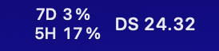
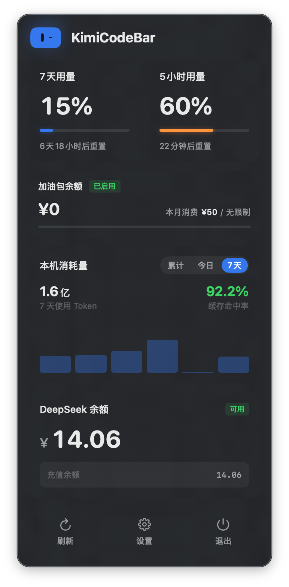
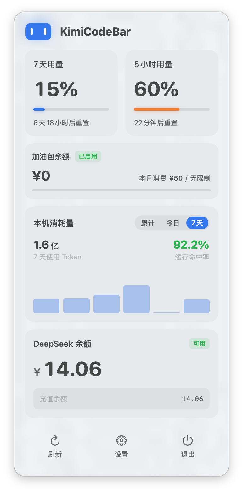

<h1 align="left" style="border-bottom: none; margin: 0">
  &nbsp;&nbsp;KimiCodeBar
</h1>

  
  
  
  

[English](README_EN.md) | 中文

🌐 **官网：** [https://xifandev.github.io/KimiCodeBar/](https://xifandev.github.io/KimiCodeBar/)

专为 Kimi Code 打造的用量监控小工具，在菜单栏轻量化运行，限额一目了然。

#

#### 下载安装：<a href="https://github.com/xifandev/KimiCodeBar/releases">GitHub Releases</a>

#### 欢迎提交：<a href="https://github.com/xifandev/KimiCodeBar/issues">Issues</a> 反馈问题或建议

#

### 👇 菜单栏实时监控

### ✨ 菜单栏弹出小面板

  
  

### ✨ 多平台支持

支持 Kimi Code 和 DeepSeek 双平台切换，一键查看各平台用量余额。

### ✨ 快速登录

采用 Kimi Code 官方接口，支持浏览器一键授权登录，同时保留 API Key 登录方式，可在设置中自由切换。

### ✨ 本机消耗量

自动扫描本地 Kimi Code 会话记录，展示 Token 消耗总量和按天柱状图，支持累计 / 今日 / 7 天三种时间范围。

### ✨ 原生 macOS 体验

适配 macOS Liquid Glass 设计语言，系统级 Material 背景与语义色彩，自动跟随浅色 / 深色模式。

#

### 🔒 隐私安全

数据仅本地存储，所有 API 只与 Kimi / DeepSeek 官方通信，代码全部开源。

#

### 🛠 系统要求

- macOS 14.0 及以上

#

### 欢迎提交 👉 <a href="https://github.com/xifandev/KimiCodeBar/issues">Issues</a> 反馈问题或建议

#

###

  
  
